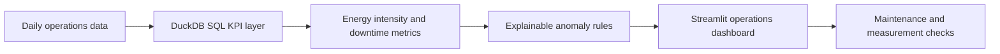

# Factory Energy KPI Dashboard

一个难度适中、面向工业与能源运营场景的可复现数据分析项目：用合成工厂日运营数据，计算单位能耗、停机率和缺陷率，识别异常产线，并通过 Streamlit Dashboard 支持运营排查。

项目围绕一个容易讲清楚的业务问题展开：

> **哪座工厂、哪条产线的能效正在变差？应该先排查什么？**

## 项目能力

- **SQL 指标层**：使用 DuckDB 将日粒度运营数据聚合为周粒度 KPI；
- **Python 分析**：完成能耗强度、停机率、缺陷率和峰值负载等指标计算；
- **异常识别**：用产线自身历史均值和标准差生成可解释的 `energy_intensity_zscore`，避免一上来使用难以解释的复杂模型；
- **BI 看板**：Streamlit + Plotly 展示工厂对比、产线趋势、异常清单和排查动作；
- **工程化**：合成数据生成器、数据字典、测试、CI 和 MIT License。

## 数据流程



## 指标口径

| 指标 | 口径 | 业务含义 |
| --- | --- | --- |
| `energy_intensity_kwh_per_unit` | 总能耗 / 产量 | 生产一件产品消耗多少电 |
| `downtime_rate` | 停机分钟 /（运行分钟 + 停机分钟） | 设备可用性损失代理 |
| `defect_rate` | 缺陷数量 / 产量 | 质量波动信号 |
| `avg_peak_kw` | 周内日峰值功率均值 | 观察峰值负荷与容量压力 |
| `energy_intensity_zscore` | 相对同一产线历史均值的标准化偏差 | 判断是否偏离自身基线 |

## 快速开始

```bash
git clone https://github.com/qiiuai/factory-energy-kpi-dashboard.git
cd factory-energy-kpi-dashboard

python -m venv .venv
# Windows PowerShell: .venv\Scripts\Activate.ps1
# macOS/Linux: source .venv/bin/activate

pip install -r requirements.txt
python scripts/run_pipeline.py
streamlit run app.py
```

运行测试：

```bash
pytest
```

流水线会生成被 `.gitignore` 忽略的本地目录：

- `data/generated/`：合成日运营数据；
- `artifacts/`：周 KPI、工厂汇总、异常清单和运行摘要。

## 目录结构

```text
.
├── app.py
├── data/README.md
├── docs/methodology.md
├── sql/energy_kpi.sql
├── scripts/run_pipeline.py
├── src/factory_energy_analytics/
│   ├── generate_data.py
│   └── pipeline.py
├── tests/test_pipeline.py
├── pyproject.toml
└── requirements.txt
```

## 数据边界

数据由代码确定性生成，不代表任何真实工厂、设备、能源消耗或施耐德电气内部数据。异常标记只用于演示运营分析方法，不能直接替代设备告警、维护记录、计量校验或安全决策。

